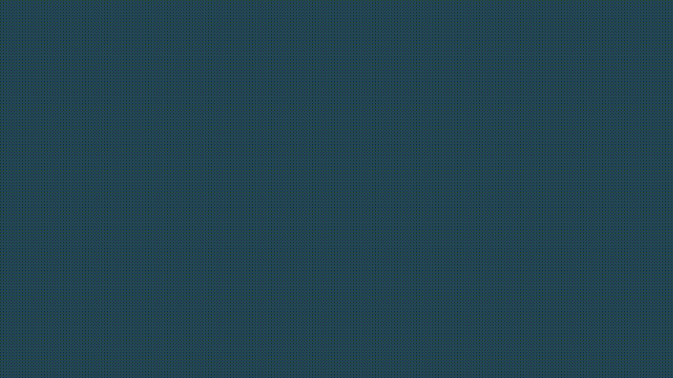

<h1 align=center>Garbage Classification | <a href="https://garbageclassification.vercel.app/">Demo</a></h1>

**Klasifikasi Jenis Sampah Menggunakan Image Classification (Garbage Classification)**.  
Aplikasi yang mengintegrasikan model Machine Learning Image Classification untuk klasifikasi 12 jenis sampah secara End-to-End bagi pengguna. Pada versi 2.0, aplikasi ini dibangun menggunakan *TensorFlow* dan *React.js*.

  

---
## Cara Menjalankan 📥

Untuk menjalankan aplikasi di *Local Environment* Anda, cukup lakukan langkah-langkah ini:

- Clone Repository ini.
- Masuk ke direktori project.
- Install package yang dibutuhkan **`npm install`**.
- Jalankan **`npm run start`** untuk menjalankan aplikasi di *Development Mode*.
- Buka browser Anda dengan alamat **`http://localhost:3000`** atau Di Jaringan Anda (IPv4) **`http://AlamatIP:3000`**.
- Arahkan ke halaman Klasifikasikan dengan mengklik tombol **`Mulai Sekarang`**.
- Anda dapat mencoba mengupload gambar Anda, kemudian klik tombol **Klasifikasikan**.

---

## Pengembang 👨‍💻

Capstone Project SIB B1 Dicoding Team ID: **CSD-114**

- Gusti Muhammad Aulia Nur Sulthan (M247R6216) &mdash; [**LinkedIn**](https://www.linkedin.com/in/tann20) | [**GitHub**](https://github.com/tnnz20)
- Virgiawan Teguh Kusuma (M218R6173) &mdash; [**LinkedIn**](https://www.linkedin.com/in/virgiawankusuma) | [**GitHub**](https://github.com/virgiawankusuma/)

---

## Credits 🌟

- Datasets &mdash; **[Kaggle Garbage Classification (12 classes)](https://www.kaggle.com/mostafaabla/garbage-classification)**
 - Pre-trained Model &mdash; **[MobileNetV2](https://www.tensorflow.org/api_docs/python/tf/keras/applications/mobilenet_v2/MobileNetV2)**
- Palette &mdash; **[Generate from Coolors](https://coolors.co/264653-2a9d8f-e76f51-ddd8b8-ffffff)**
- Icon &mdash; **[Font Awesome](https://fontawesome.com)**
- 3D Illustration &mdash; **[Icons8](https://icons8.com/illustrations)**
